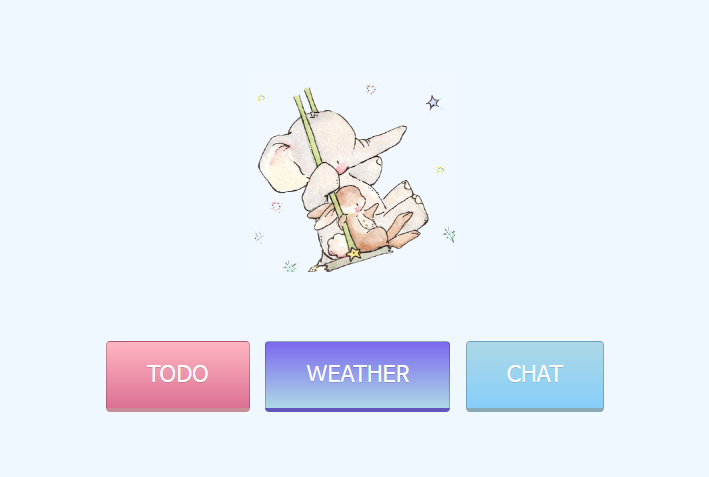
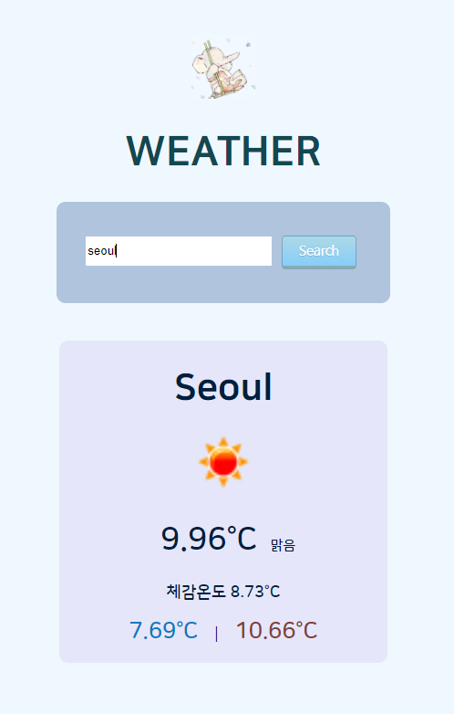
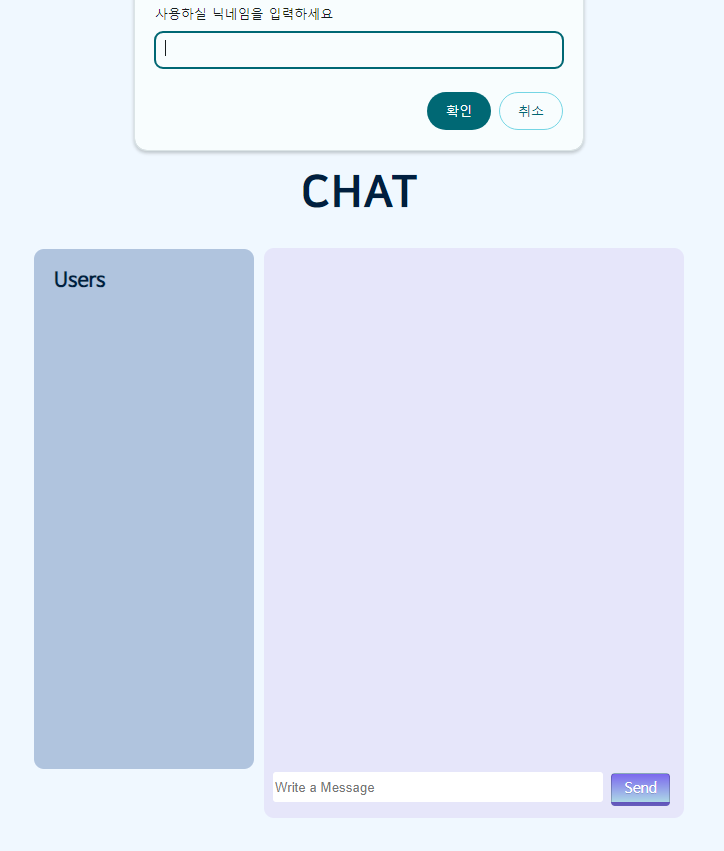
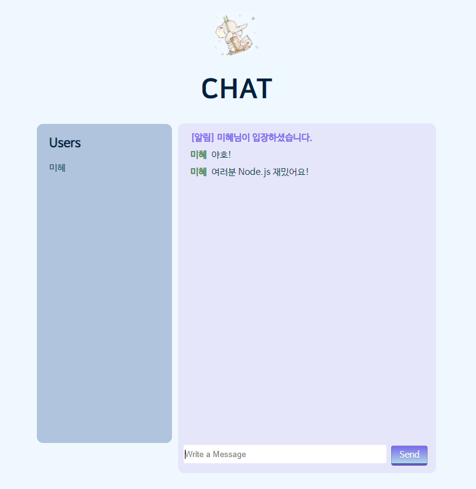

### README

# Node.js를 활용한 mini project

   
  
   

## 프로젝트 소개

 Node.js를 배우고 이를 활용하여 유용하고 꼭 필요한 기능들만 넣어만든 미니 프로젝트입니다.

 

## 기술 스택

 

## 구현 기능

### 기능 1 : 메인화면

 

사용자가 사용할 수 있는 To-do, 날씨, 채팅 세 개의 기능을 명확하게 보여줍니다.
 

### 기능 2 : 도시별 날씨 확인

<strong></strong> 

도시의 (영어)이름을 검색하면 해당 도시의 날씨를 보여줍니다.
 

### 기능 3 : 채팅

<strong></strong> 

소켓을 이용하여 대화할 수 있습니다.
 

### 기능 4 : To-do List (수정중)

<strong></strong> 

 

 
